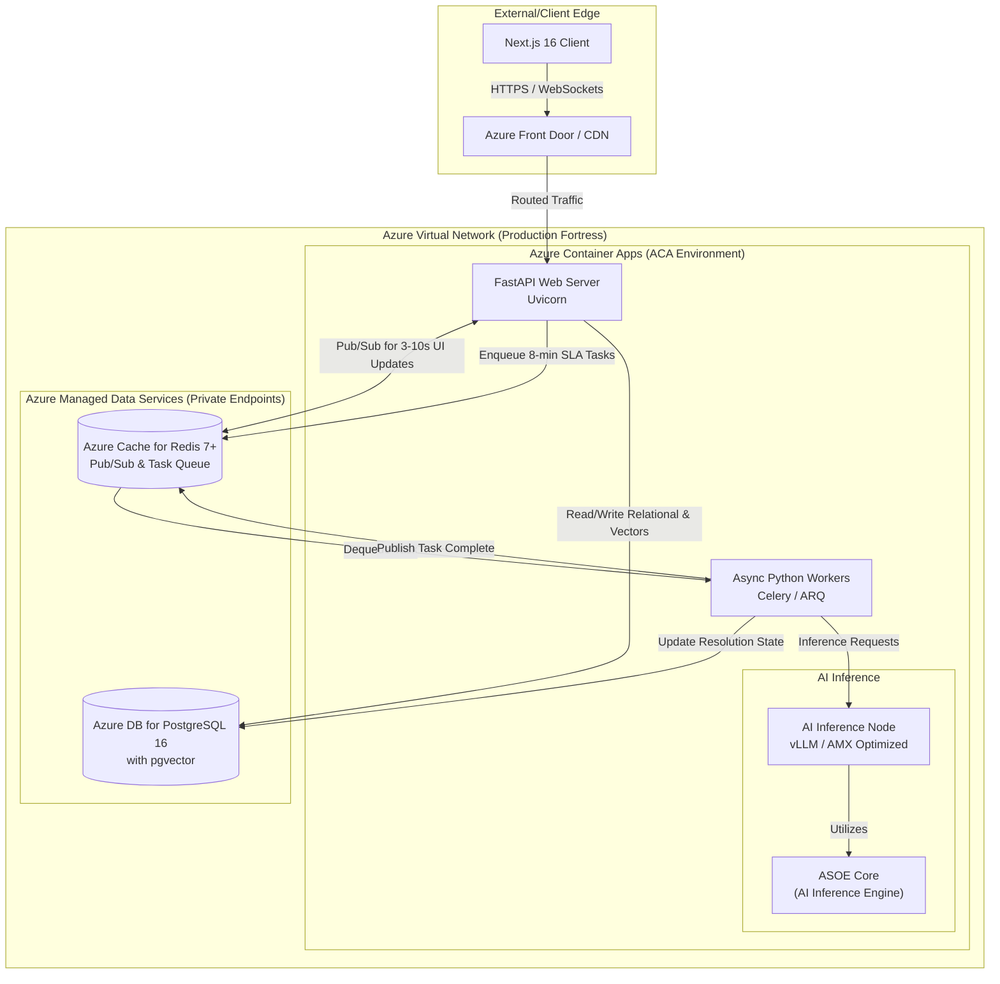

# Comprehensive Architecture Proposal: ASOE UI & Core Stack

## Executive Summary
This document outlines the comprehensive technical architecture and phase-wise deployment strategy for the **ASOE (Agentic ERP Layer Of Enterprises)**. The architecture is designed to support 500 concurrent users, deliver 3-10 second real-time updates, and reliably process complex AI tasks with an 8-minute resolution SLA. 

This version incorporates advanced recommendations for network security, AI hardware acceleration, and database indexing strategies.

---

## Architecture Flow & Interactions

---
## Architecture Decision Points:

1. Frontend: Next.js 15 (App Router) + Shadcn/ui + Tailwind CSS
Core Decision: Use React Server Components (RSC) with output: 'standalone' to prevent vendor lock-in.
Edge Caching: Implement Azure Front Door in front of the Container Apps in Phase 3. This offloads static asset delivery (Tailwind CSS, fonts) from the container instances, reserving compute purely for the dynamic App Router rendering and WebSocket connections.
2. Backend API: FastAPI (0.115+)
Core Decision: Async-first routing and native WebSocket support for real-time state.
Connection Management: For 503 concurrent WebSocket connections, configure FastAPI to use a robust ASGI server like Uvicorn running with multiple worker processes. Ensure the Redis Pub/Sub integration is strictly asynchronous to prevent blocking the event loop.
3. Database: PostgreSQL 16+ with Pgvector
Core Decision: Consolidated relational and vector storage.
Indexing Strategy: Exact nearest-neighbor searches (IVFFlat) will degrade as the exception database grows. The board mandates implementing HNSW (Hierarchical Navigable Small World) indexing on the pgvector columns from Day 1 to ensure sub-millisecond similarity search queries, even at scale.
4. Real-Time Capabilities & Task Queues: Redis 7+
Core Decision: Redis as the backplane for WebSockets and task queuing.
Cache Invalidation: Implement a strict "Write-through" cache strategy for the ASOE exception states. When an AI worker resolves an exception, it must write to Postgres and update the Redis cache simultaneously before publishing the WebSocket event, ensuring the UI never fetches stale data during the 3-10 second update window.
5. AI Worker & Inference Layer
Core Decision: Decouple heavy 8-minute SLA tasks from the web server.
Hardware Acceleration: To optimize inference costs and processing times for the CPG agentic routines, deploy dedicated inference containers within the ACA environment. Utilize vLLM for high-throughput Large Language Model serving. For specialized models, target CPU acceleration utilizing Intel Xeon CPUs with AMX (Advanced Matrix Extensions) to maximize performance-per-watt without relying strictly on expensive GPU SKUs.
6. Deployment Strategy: Vercel (Initial) to Azure Container Apps (Target)
Core Decision: Vercel for R&D speed; Azure VNet for production security.
Board Upgrade (Zero-Trust Security): In Phase 3, implement Azure Managed Identities for passwordless authentication between the FastAPI containers and PostgreSQL/Redis. Ensure the data services utilize Private Endpoints, physically restricting all traffic to the internal VNet.
