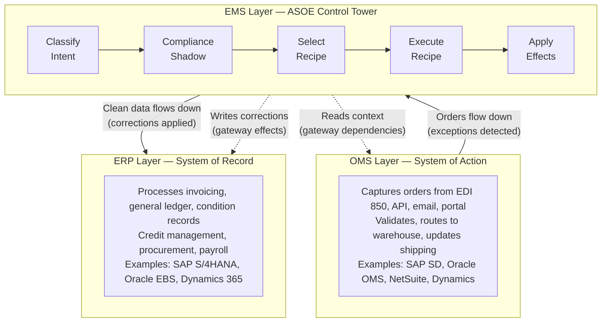
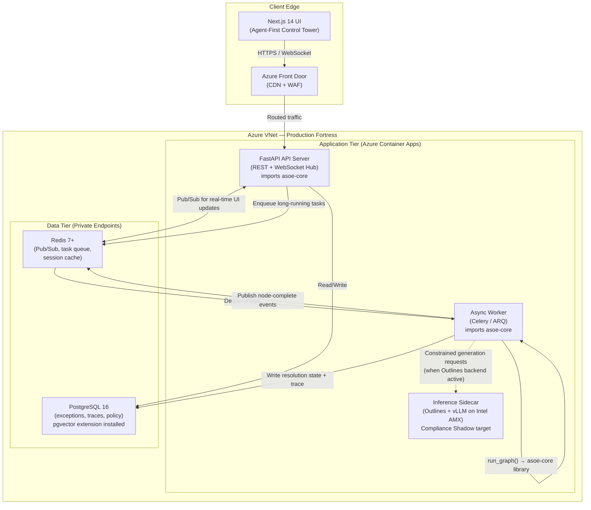
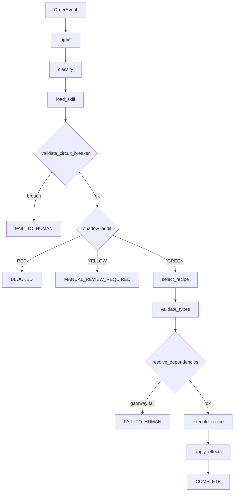
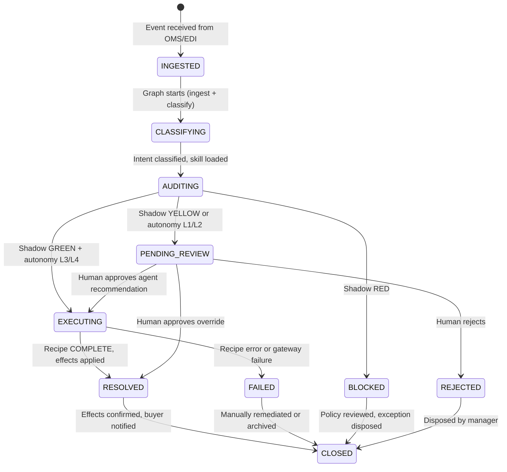
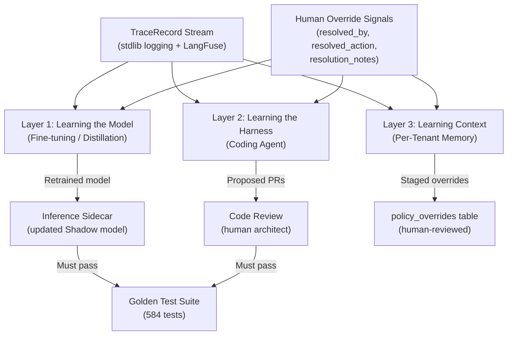

# Unified Platform Architecture: ASOE

**Platform:** ASOE (Agentic System of Engagement)
**Version:** 1.0.0
**Repositories:** `asoe2` (Core Engine), `asoe-ui` (Frontend Control Tower)
**Status:** Unified Authoritative Reference — supersedes `asoe2/architecture_v2.md`, `asoe-ui/Architecture.md` (arch_proposal), and `asoe-ui/plan.md`

---

## 1. Executive Summary

ASOE is a deterministic, compliance-first orchestration platform for resolving Order-to-Cash (O2C) exceptions in Consumer Packaged Goods (CPG) supply chains. It sits between Order Management Systems (OMS) and Enterprise Resource Planning systems (SAP, Oracle) as an independent Exception Management System — a "Control Tower" that catches what neither upstream nor downstream can resolve alone.

### Platform Principles

1. **Determinism Over Autonomy.** AI reasoning is constrained to classification and context loading. All execution flows through immutable, pre-validated Python recipes. The LLM never writes code, guesses thresholds, or invents business logic.

2. **Compliance Before Execution.** Every proposed action is audited by a Compliance Shadow before any recipe runs. Verdicts are constrained to GREEN (proceed), YELLOW (human review required), or RED (halt). There are no overrides and no bypasses.

3. **Agent-First, Not Dashboard-First.** The UI is a control tower where the system is the primary actor. Agents classify, audit, and resolve exceptions autonomously. Humans intervene at decision points — approvals, overrides, escalations — not at every step.

4. **Decoupled Reasoning and Execution.** Skills guide reasoning (the "Brain"). Recipes execute deterministic logic (the "Muscle"). The orchestration layer routes between them. These three concerns never cross boundaries.

5. **Observability as a First-Class Product.** Every graph execution emits a structured TraceRecord. Every decision — intent, shadow verdict, recipe, gateway call, terminal status — is logged, correlated via trace_id, and auditable.

### V1 Scope

| Dimension | V1 Boundary |
|---|---|
| **Exception types** | Pricing discrepancies, promotional corrections, credit blocks, duplicate purchase orders |
| **Intents** | `CONTRACTUAL_CORRECTION`, `CREDIT_BLOCK`, `MASS_PRICING_ERROR`, `DUPLICATE_PO` |
| **Recipes** | `PriceAdjustmentRecipe.py`, `CreditHoldReleaseRecipe.py`, `DuplicatePORecipe.py` |
| **Terminal statuses** | `COMPLETE`, `FAIL_TO_HUMAN`, `MANUAL_REVIEW_REQUIRED`, `BLOCKED`, `REJECTED` |
| **Pipeline** | 11-node LangGraph state machine |
| **Lifecycle** | 8-state exception lifecycle (INGESTED through CLOSED) |
| **Tests** | 584 passing (16 test files) |
| **RAG** | Deferred to V2 — all context is structured and resolved via typed gateways |
| **Continual learning** | V2 design blueprint included; not a V1 deliverable |

---

## 2. System Context

ASOE operates as an independent orchestration layer between two enterprise system tiers. It does not replace either — it bridges the gap where exceptions fall through.



### System Boundary

ASOE **owns:** exception classification, compliance audit, deterministic resolution, buyer notification, and the audit trail.

ASOE **does not own:** order lifecycle, inventory, shipping, invoicing, or general ledger. Those remain in OMS and ERP respectively.

### Exception Responsibility

| Exception Type | Where Managed | ASOE Role |
|---|---|---|
| Operational (wrong SKU, out of stock) | OMS Layer | Not in scope |
| Financial (invoice mismatch, credit limit) | ERP Layer / EMS | **ASOE resolves** |
| Cross-system (duplicate PO, price mismatch between OMS and ERP) | **EMS Layer (ASOE)** | **ASOE resolves** |

### Human Actors

| Role | Description | Access Level |
|---|---|---|
| `analyst` | Order Management Analyst | Queue view, approve/override individual exceptions, view agent reasoning |
| `manager` | Trade/Pricing Manager | All analyst access + bulk actions, rule config, escalation targets |
| `admin` | System Administrator | All access + user management, SSO config, agent settings, audit logs |
| `viewer` | Read-Only Stakeholder | View queues and dashboards, no action buttons |
| `partner` | External Partner | Scoped view of their own orders only |

### External System Integration

| System | Protocol | Direction | Adapter Status (V1) |
|---|---|---|---|
| SAP S/4HANA | RFC/BAPI via gateway adapter | Read (pricing, credit) + Write (condition records, hold release) | Stubbed |
| OMS (generic) | REST API via gateway adapter | Read (fulfillment status, PO details) | Stubbed |
| EDI Gateway | Azure Event Hubs (EDI 850 → JSON) | Inbound events | Stubbed |
| Buyer Portal | Notification gateway effect | Outbound notifications | Stubbed |
| LangFuse | HTTP SDK (optional) | Trace forwarding | Live (tested against self-hosted v2.95.1) |

---

## 3. Platform Architecture Overview

ASOE Core is a **Python library**, not a standalone service. Both the FastAPI API server and the async worker import it directly. The inference sidecar is a separate optional container that serves constrained-generation models.



### Key Clarifications

**ASOE Core is not an "AI Inference Engine."** It is a deterministic state machine that:
- Classifies intent via a **3-tier constrained backend chain** (Custom → Outlines → Deterministic Fallback)
- Audits via a Compliance Shadow (currently deterministic; target: Llama 3.1 8B on Intel AMX CPU)
- Executes immutable Python recipes
- Mediates all infrastructure I/O through a hexagonal gateway layer

In V1.0, the `DeterministicFallbackBackend` handles all decision points without any LLM call. The inference sidecar becomes relevant when:
- The Compliance Shadow needs a real model (Llama 3.1 8B for penalty matrix auditing)
- The Outlines constrained-generation backend is activated for production use
- Human-facing explanations need nuanced language (Claude Sonnet via Azure AI Foundry)

### Five Runtime Domains

| Domain | Technology | Responsibility |
|---|---|---|
| **ASOE UI** | Next.js 14 (App Router, TypeScript) | Agent-first frontend, WebSocket consumer, RBAC-enforced views |
| **API Server** | FastAPI (async, Uvicorn) | REST endpoints, WebSocket hub, synchronous graph invocations, auth |
| **Async Worker** | Celery / ARQ + asoe-core | Long-running graph executions (8-min SLA), Event Hubs consumer |
| **Inference Sidecar** | Outlines + vLLM on Intel Xeon AMX | Constrained generation, Compliance Shadow model serving |
| **Data Tier** | PostgreSQL 16 + Redis 7+ | Exception state, audit trail, policy config, real-time pub/sub |

---

## 4. Component Topology

### Development (Docker Compose)

| Container | Source | Contents | Always On? |
|---|---|---|---|
| `asoe-core` | `asoe2/Dockerfile.core` | FastAPI dev server + asoe-core library (LangGraph, recipes, Compliance Shadow) | Yes |
| `asoe-ui-sandbox` | `asoe2/Dockerfile.ui` | Streamlit sandbox UI (for core-only development) | Yes |
| `asoe-inference` | `asoe2/Dockerfile.inference` | Outlines + torch + transformers (local LLM) | Optional (`--profile inference`) |
| `asoe-ui` | `asoe-ui/` (npm dev) | Next.js 14 dev server (runs outside Docker for hot reload) | Manual |
| `postgres` | Official image | PostgreSQL 16 + pgvector | Yes |
| `redis` | Official image | Redis 7+ | Yes |

All images use non-root user (`asoe`, UID 1000) and `uv` for deterministic Python dependency resolution.

### Production (Azure Kubernetes Service)

| Deployment | Replicas | Node Pool | Source | Key Config |
|---|---|---|---|---|
| `asoe-ui` | 2 | Standard | `asoe-ui/` (standalone build) | `output: 'standalone'` in next.config |
| `asoe-api` | 2 | Standard | `asoe2/` + FastAPI layer | Topology spread, Workload Identity |
| `asoe-worker` | 2 | Standard | `asoe2/` + Celery/ARQ layer | Event Hubs consumer, graph executor |
| `asoe-inference` | 1 | Intel AMX (Xeon Sapphire Rapids) | `asoe2/Dockerfile.inference` | 20Gi memory, AMX nodeSelector |

**Infrastructure services:** Azure Front Door (CDN + WAF), Azure Database for PostgreSQL (Flexible Server, Private Endpoint), Azure Cache for Redis (Private Endpoint), Azure Key Vault (CSI driver for secrets), Azure Event Hubs (EDI 850 ingestion).

**Security posture:** Azure Managed Identities for passwordless auth between containers and data services. Private Endpoints for PostgreSQL and Redis — no public network access. Secrets mounted via Key Vault CSI driver (`k8s/core/secret-provider.yaml`). No credentials in source code, Dockerfiles, or environment variable defaults.

---

## 5. ASOE Core Integration: The Skill-Shadow-Recipe Engine

The core engine resolves the central tension — AI flexibility vs. enterprise determinism — via the **Skill-Shadow-Recipe** pattern:

- **Top Guardrail:** Structured progressive disclosure (Skill definitions) and typed gateway dependencies for deterministic context loading.
- **Middle:** Cloud-based reasoning core (Claude Sonnet) or deterministic fallback.
- **Bottom Guardrail:** A localized Compliance Shadow auditor and strictly typed, immutable Python execution Recipes.

### 5.1 The 11-Node LangGraph Pipeline



Each node function has the signature `def node_name(state: GraphState) -> GraphState` and returns a partial state update. Source: `orchestration/nodes.py`.

| # | Node | Responsibility | Failure Behavior |
|---|---|---|---|
| 1 | `ingest` | Validates `OrderEvent` required fields, computes `batch_total_variance`, increments `update_count` | `FAIL_TO_HUMAN` on missing `order_id`, `po_price`, or `sap_base_price` |
| 2 | `classify` | Computes `PricingDiscrepancy`, calls `backend.classify_intent()` → constrained to `AllowedIntent` enum | Routes to `FAIL_TO_HUMAN` on UNKNOWN intent |
| 3 | `load_skill` | Loads `skills/*.md` verbatim via `SkillLoader.select_for_event()` — no summarization | Continues with no skill if none matches |
| 4 | `validate_circuit_breaker` | Checks `update_count` vs `CIRCUIT_BREAKER_MAX_UPDATES` (50) and `batch_total_variance` vs `CIRCUIT_BREAKER_MAX_VARIANCE` ($10,000) | `FAIL_TO_HUMAN` on breach |
| 5 | `shadow_audit` | Creates `ComplianceShadow`, calls `audit()` → `ComplianceDecision`, then `enforce()` → `ShadowEnforcement` | GREEN → continue, YELLOW → `MANUAL_REVIEW_REQUIRED`, RED → `BLOCKED` |
| 6 | `select_recipe` | Calls `backend.propose_recipe()` → constrained to `AllowedRecipeName` | `FAIL_TO_HUMAN` if no recipe available |
| 7 | `validate_types` | Builds `RecipeInvocation` with typed params; injects policy thresholds from `contracts/policy.py` | `FAIL_TO_HUMAN` on missing required params |
| 8 | `resolve_dependencies` | Reads `RecipeSpec.dependencies`, calls gateways via `GatewayExecutor`, stores results in `resolved_data` | `FAIL_TO_HUMAN` on gateway failure |
| 9 | `execute_recipe` | Calls `RecipeExecutor.run()`, routes by autonomy level (L1/L2 → `MANUAL_REVIEW_REQUIRED`, L3/L4 → auto-execute) | `FAIL_TO_HUMAN` on recipe error |
| 10 | `apply_effects` | Reads `RecipeSpec.effects`, calls gateways for ERP writes and buyer notifications | Logs failure but does NOT undo recipe result |
| 11 | END | Terminal state; `TraceRecord` emitted to stdlib logging + optional LangFuse forwarding | — |

**Explain Mode** (`ASOE_EXPLAIN_MODE=1`): Replaces `execute_recipe` with `explain_only` node. Both `resolve_dependencies` and `apply_effects` are skipped entirely. The full reasoning pipeline runs (classify → shadow → select recipe → validate types) but no recipe executes and no side effects fire. Returns `MANUAL_REVIEW_REQUIRED` with a dry-run summary.

**Kill Switch** (`ASOE_KILL_SWITCH=1`): Checked in `run_graph()` **before any node runs**. Zero nodes execute. Returns `FAIL_TO_HUMAN` immediately. TraceRecord is still emitted.

### 5.2 GraphState Schema

The complete typed state envelope passed through the pipeline. Source: `contracts/models.py`, `GraphState` class with `extra="forbid"` (no untyped fields allowed).

| Field | Type | Default | Populated By |
|---|---|---|---|
| `event` | `OrderEvent` | required | Caller |
| `discrepancy` | `Optional[PricingDiscrepancy]` | `None` | `classify` |
| `rag_context` | `RagContext` | factory | Reserved for V2 |
| `skill` | `Optional[SkillDocument]` | `None` | `load_skill` |
| `intent` | `Intent` | `Intent.UNKNOWN` | `classify` |
| `confidence` | `float` | `0.0` | `classify` |
| `shadow` | `Optional[ComplianceDecision]` | `None` | `shadow_audit` |
| `selected_recipe` | `Optional[str]` | `None` | `select_recipe` |
| `invocation` | `Optional[RecipeInvocation]` | `None` | `validate_types` |
| `execution_log` | `Optional[ExecutionLog]` | `None` | `execute_recipe` |
| `final_status` | `Optional[TerminalStatus]` | `None` | Any node (on halt/completion) |
| `explanation` | `Optional[str]` | `None` | Auto-populated at terminal state |
| `update_count` | `int` | `0` | `ingest` |
| `batch_total_variance` | `float` | `0.0` | `ingest` |
| `resolved_data` | `Dict[str, Any]` | `{}` | `resolve_dependencies` |
| `effect_results` | `List[GatewayResponse]` | `[]` | `apply_effects` |

### 5.3 Constrained Generation

All LLM-generated values consumed by code are **constrained at generation time** via Pydantic Literal types. Free-form text is allowed only for human-facing explanations.

**3-Tier Backend Chain** (`constraints/router.py`):

```
Custom backend (env var) → OutlinesConstrainedBackend → DeterministicFallbackBackend
```

Each backend implements three methods: `classify_intent()`, `propose_recipe()`, `shadow_decision()`. If `OutlinesConstrainedBackend` fails to initialize (missing `outlines` package), the router degrades gracefully to `DeterministicFallbackBackend` with a `logger.warning()`.

| Constrained Output | Schema | Allowed Values |
|---|---|---|
| Intent classification | `IntentDecision` → `AllowedIntent` | `CONTRACTUAL_CORRECTION`, `CREDIT_BLOCK`, `MASS_PRICING_ERROR`, `DUPLICATE_PO` |
| Shadow verdict | `ShadowDecision` → `AllowedShadowStatus` | `GREEN`, `YELLOW`, `RED` |
| Recipe selection | `RecipeProposal` → `AllowedRecipeName` | `PriceAdjustmentRecipe.py`, `CreditHoldReleaseRecipe.py`, `DuplicatePORecipe.py` |
| Resolution action | `AllowedResolutionAction` | `BLOCK_AND_NOTIFY`, `MERGE`, `SUPERSEDE`, `ALLOW_BOTH`, `ESCALATE`, `REQUEST_BUYER_CONFIRMATION` |

### 5.4 Policy Externalization

All business thresholds live in `contracts/policy.py`. **Recipes never import from the policy module.** All thresholds are injected by the orchestration layer via `validate_types` → `RecipeInvocation.params`.

| Constant | Value | Consumed By |
|---|---|---|
| `MAX_DISCOUNT_ALLOWED` | `0.15` (15%) | `PriceAdjustmentRecipe` via `erp_context` |
| `PRICE_CONDITION_TYPE` | `"YK07"` | `PriceAdjustmentRecipe` via `erp_context` |
| `CREDIT_AUTHORIZED_ROLES` | `("ORDER_MANAGER", "FINANCE_DIRECTOR")` | `CreditHoldReleaseRecipe` as param |
| `CREDIT_EXPOSURE_TOLERANCE` | `5_000.0` | `CreditHoldReleaseRecipe` as param |
| `DUPLICATE_PO_THRESHOLD_AUTO_BLOCK` | `0.90` | `DuplicatePORecipe` as param |
| `DUPLICATE_PO_THRESHOLD_REVIEW_REQUIRED` | `0.70` | `DuplicatePORecipe` as param |
| `DUPLICATE_PO_THRESHOLD_SOFT_FLAG` | `0.50` | `DuplicatePORecipe` as param |
| `DUPLICATE_PO_AUTONOMY_LEVELS` | dict (action → L1–L4) | `DuplicatePORecipe` as param |
| `MASS_UPDATE_LINE_COUNT_THRESHOLD` | `10` | `constraints/fallback_backend.py` |
| `CIRCUIT_BREAKER_MAX_UPDATES` | `50` | `orchestration/utils.py` |
| `CIRCUIT_BREAKER_MAX_VARIANCE` | `10_000.0` | `orchestration/utils.py` |
| `DISCREPANCY_THRESHOLD` | `0.15` | `orchestration/utils.py` |

**Evolution path:** module constants → env vars → K8s ConfigMap → per-customer policy service. Changes at any stage require modification only in the orchestration layer and policy source, never in recipes.

### 5.5 Hexagonal Gateway Layer

Recipes never call external systems directly. Infrastructure I/O is decoupled via the Ports & Adapters pattern.

| Component | File | Role |
|---|---|---|
| Protocol (Port) | `gateways/base.py` | `InfrastructureGateway` typed interface |
| Registry | `gateways/registry.py` | Maps gateway names → adapter instances |
| Executor | `gateways/executor.py` | Wraps calls with tracing + timeout enforcement via `concurrent.futures` |
| Stub (Test) | `gateways/stub.py` | Canned responses, call recording, no network |

**Typed contracts:** `GatewayRequest` (gateway_name, operation, params, trace_id, timeout_ms) and `GatewayResponse` (status: `SUCCESS` | `FAILED` | `TIMEOUT` | `UNAVAILABLE`, data, error, duration_ms).

Recipe specs declare **dependencies** (data needed pre-execution) and **effects** (writes to apply post-execution) as typed tuples. The orchestration layer resolves dependencies before recipe execution and applies effects after.

### 5.6 Workflow Runner (Saga Pattern)

Multi-step workflows are executed by `WorkflowRunner` (`workflows/runner.py`). Each step runs the **full graph independently** — its own shadow audit, its own recipe. On failure at step N, declared compensation recipes for steps 1..N-1 are invoked in **LIFO (reverse) order**.

| Result Status | Meaning |
|---|---|
| `COMPLETE` | All steps succeeded |
| `FAILED` | A step failed; no compensation recipes declared |
| `COMPENSATED` | A step failed; compensation recipes invoked for completed steps |
| `PARTIAL` | Reserved for future partial-completion modes |

---

## 6. API Contract

The FastAPI server exposes REST endpoints for CRUD operations and a WebSocket endpoint for real-time pipeline updates. All endpoints are prefixed with `/api/v1/`.

### 6.1 Authentication

All endpoints except `/api/auth/*` and `/api/v1/health` require a valid JWT Bearer token. Tokens contain `sub`, `email`, `name`, `roles[]`, `org` (tenant), `permissions[]`, and `exp` claims.

- **Access token:** 15-minute expiry, stored in httpOnly cookie
- **Refresh token:** 7-day expiry, httpOnly cookie, rotated on use

### 6.2 REST Endpoints

| Method | Path | Auth | Description |
|---|---|---|---|
| `POST` | `/api/v1/exceptions/resolve` | analyst+ | Synchronous resolution — constructs `OrderEvent`, runs `run_graph()`, returns result |
| `POST` | `/api/v1/exceptions/resolve/async` | analyst+ | Async resolution — enqueues task, returns `{ task_id, status: "queued" }` |
| `POST` | `/api/v1/exceptions/resolve/explain` | analyst+ | Explain mode dry-run — runs full pipeline without recipe execution |
| `GET` | `/api/v1/exceptions` | analyst+ | Paginated exception queue (filter by: status, intent, tenant) |
| `GET` | `/api/v1/exceptions/{id}` | analyst+ | Exception detail including lifecycle state and GraphState |
| `PATCH` | `/api/v1/exceptions/{id}/override` | manager+ | Human override: `{ action, notes, resolved_by }` |
| `GET` | `/api/v1/exceptions/{id}/trace` | analyst+ | Full `TraceRecord` JSON for audit |
| `POST` | `/api/v1/workflows` | manager+ | Multi-step workflow: `WorkflowDefinition` + events → `WorkflowResult` |
| `GET` | `/api/v1/exceptions/stats` | analyst+ | Dashboard metrics (open count, auto-resolved, avg resolution time) |
| `PUT` | `/api/v1/policies/{tenant_id}` | admin | Update tenant-specific policy overrides |
| `POST` | `/api/auth/login` | public | Email/password authentication → `{ accessToken, refreshToken, user }` |
| `POST` | `/api/auth/sso/init` | public | SSO initiation → `{ redirectUrl }` for IdP redirect |
| `POST` | `/api/auth/refresh` | public | Token refresh → `{ accessToken }` |
| `GET` | `/api/auth/me` | any | Current authenticated user profile |
| `GET` | `/api/v1/health` | public | Health check: `{ status, version, kill_switch, explain_mode }` |

### 6.3 Standard Error Envelope

```json
{
  "error": {
    "code": "SHADOW_BLOCKED",
    "message": "Compliance Shadow returned RED — execution halted by policy.",
    "trace_id": "123e4567-e89b-12d3-a456-426614174000",
    "details": { "shadow_verdict": "RED", "policy_hits": ["PENALTY_MATRIX_VIOLATION"] }
  }
}
```

### 6.4 Pagination

Cursor-based pagination on all list endpoints:

```json
{
  "data": [ ... ],
  "cursor": "eyJpZCI6ICIxMjMifQ==",
  "has_more": true
}
```

### 6.5 WebSocket Endpoint

`ws://host/api/v1/ws` — detailed in Section 8.

---

## 7. Data Architecture

### 7.1 Exception Lifecycle State Machine

Exceptions have a persistence-level lifecycle that extends beyond the `TerminalStatus` enum in GraphState. The UI exception queue is driven by this state.



**8 states:** INGESTED, CLASSIFYING, AUDITING, PENDING_REVIEW, EXECUTING, RESOLVED, FAILED, BLOCKED, REJECTED, CLOSED.

### 7.2 PostgreSQL Schema

#### `exceptions` table

```sql
CREATE TABLE exceptions (
    id                UUID PRIMARY KEY DEFAULT gen_random_uuid(),
    tenant_id         VARCHAR(100) NOT NULL,
    order_id          VARCHAR(100) NOT NULL,
    event_type        VARCHAR(50) NOT NULL,
    intent            VARCHAR(30) CHECK (intent IN (
                        'CONTRACTUAL_CORRECTION', 'CREDIT_BLOCK',
                        'MASS_PRICING_ERROR', 'DUPLICATE_PO', 'UNKNOWN')),
    lifecycle_state   VARCHAR(20) NOT NULL DEFAULT 'INGESTED',
    shadow_verdict    VARCHAR(10),
    selected_recipe   VARCHAR(50),
    final_status      VARCHAR(30),
    trace_id          UUID NOT NULL,
    resolution_data   JSONB DEFAULT '{}',
    resolved_by       VARCHAR(100),
    resolved_action   VARCHAR(30),
    resolution_notes  TEXT,
    created_at        TIMESTAMPTZ NOT NULL DEFAULT NOW(),
    updated_at        TIMESTAMPTZ NOT NULL DEFAULT NOW(),
    context_embedding VECTOR(1536)  -- pgvector: installed, not indexed until V2
);

CREATE INDEX idx_exceptions_tenant_state ON exceptions (tenant_id, lifecycle_state, created_at DESC);
CREATE INDEX idx_exceptions_trace ON exceptions (trace_id);
CREATE INDEX idx_exceptions_order ON exceptions (tenant_id, order_id);
```

#### `traces` table

```sql
CREATE TABLE traces (
    id              UUID PRIMARY KEY DEFAULT gen_random_uuid(),
    exception_id    UUID NOT NULL REFERENCES exceptions(id),
    trace_id        UUID NOT NULL,
    tenant_id       VARCHAR(100) NOT NULL,
    trace_record    JSONB NOT NULL,  -- Full TraceRecord (see §5 observability)
    created_at      TIMESTAMPTZ NOT NULL DEFAULT NOW()
);

CREATE INDEX idx_traces_trace_id ON traces (trace_id);
CREATE INDEX idx_traces_tenant ON traces (tenant_id, created_at DESC);
```

#### `policy_overrides` table

```sql
CREATE TABLE policy_overrides (
    id              UUID PRIMARY KEY DEFAULT gen_random_uuid(),
    tenant_id       VARCHAR(100) NOT NULL,
    policy_key      VARCHAR(100) NOT NULL,  -- e.g., 'MAX_DISCOUNT_ALLOWED'
    value           JSONB NOT NULL,          -- e.g., 0.20
    effective_from  TIMESTAMPTZ NOT NULL DEFAULT NOW(),
    effective_until TIMESTAMPTZ,
    created_by      VARCHAR(100) NOT NULL,
    created_at      TIMESTAMPTZ NOT NULL DEFAULT NOW(),
    UNIQUE(tenant_id, policy_key, effective_from)
);
```

### 7.3 Redis Usage

| Purpose | Key Structure | TTL | Details |
|---|---|---|---|
| Task queue | `asoe:tasks` (stream) | N/A | Celery/ARQ task broker for async resolution |
| WebSocket fanout | `asoe:ws:{tenant_id}` (pub/sub channel) | N/A | Per-tenant channel for real-time UI updates |
| Session cache | `asoe:session:{session_id}` (hash) | 15 min | JWT validation cache |
| Circuit breaker state | `asoe:cb:{window_id}` (key) | 5 min | Update count + variance for current window |
| Rate limiting | `asoe:ratelimit:{client_id}` (sorted set) | 1 min | Per-client request rate |

### 7.4 pgvector Deferral

The pgvector extension is installed and the `context_embedding` column exists on the `exceptions` table. **However, no HNSW index is created, no embeddings are computed, and no similarity search queries exist in V1.** This preserves the RAG deferral from `architecture_v2.md` §4C: all V1 context is structured, keyed by known identifiers (retailer_id, SKU, order_id), and resolved deterministically via the gateway dependency layer.

RAG becomes justified in V2 when the system needs to search unstructured retailer contract PDFs, support free-text user queries, or ingest new document types faster than gateway adapters can be written.

---

## 8. Real-Time Communication Protocol

WebSockets backed by Redis Pub/Sub push per-node LangGraph execution updates to the UI. This powers the `WaterfallStepper` component — the real-time pipeline progress visualization.

### 8.1 Connection Lifecycle

1. **Connect:** Client opens `ws://host/api/v1/ws`
2. **Authenticate:** Client sends JWT token in the first message: `{ "type": "auth", "token": "eyJ..." }`
3. **Subscribe:** Server extracts `tenant_id` from JWT, subscribes to Redis channel `asoe:ws:{tenant_id}`
4. **Receive:** Server forwards events from Redis to the client
5. **Disconnect:** Server unsubscribes from Redis channel

### 8.2 Event Envelope

```typescript
interface WSEvent {
  type: "pipeline_progress" | "exception_update" | "task_complete" | "error";
  trace_id: string;
  exception_id: string;
  tenant_id: string;
  timestamp: string;  // ISO 8601
  payload: PipelineProgressPayload | ExceptionUpdatePayload | TaskCompletePayload;
}

interface PipelineProgressPayload {
  node: "ingest" | "classify" | "load_skill" | "validate_circuit_breaker"
      | "shadow_audit" | "select_recipe" | "validate_types"
      | "resolve_dependencies" | "execute_recipe" | "apply_effects";
  status: "started" | "completed" | "failed";
  duration_ms?: number;
  data?: {
    intent?: string;
    confidence?: number;
    shadow_verdict?: string;
    shadow_reasons?: string[];
    selected_recipe?: string;
    final_status?: string;
    explanation?: string;
  };
}

interface ExceptionUpdatePayload {
  lifecycle_state: string;
  updated_fields: Record<string, unknown>;
}

interface TaskCompletePayload {
  task_id: string;
  final_status: string;
  explanation: string;
}
```

### 8.3 Event Flow

As each LangGraph node completes, the async worker:
1. Publishes a `pipeline_progress` event to Redis channel `asoe:ws:{tenant_id}`
2. The FastAPI WebSocket hub receives the event from Redis
3. The hub forwards it to all connected clients for that tenant
4. The UI's `WaterfallStepper` component renders the node as complete and advances to the next

Example event sequence for a successful resolution:
```
→ { node: "ingest", status: "completed" }
→ { node: "classify", status: "completed", data: { intent: "DUPLICATE_PO", confidence: 0.95 } }
→ { node: "load_skill", status: "completed" }
→ { node: "validate_circuit_breaker", status: "completed" }
→ { node: "shadow_audit", status: "completed", data: { shadow_verdict: "GREEN" } }
→ { node: "select_recipe", status: "completed", data: { selected_recipe: "DuplicatePORecipe.py" } }
→ { node: "validate_types", status: "completed" }
→ { node: "resolve_dependencies", status: "completed" }
→ { node: "execute_recipe", status: "completed" }
→ { node: "apply_effects", status: "completed", data: { final_status: "COMPLETE" } }
```

### 8.4 Resilience

- **Reconnection:** Client reconnects with exponential backoff (1s, 2s, 4s, 8s, max 30s). Sends `last_seen_timestamp` on reconnect; server replays missed events from a short-lived Redis stream buffer (60-second retention).
- **Fallback:** If WebSocket connection fails entirely, the UI falls back to polling `GET /api/v1/exceptions/{id}` every 3 seconds.

---

## 9. Security & Compliance

### 9.1 Authentication

**Primary (Enterprise SSO):**
```
User clicks "Sign in with SSO"
  → Next.js calls FastAPI POST /api/auth/sso/init
  → FastAPI returns IdP redirect URL (SAML 2.0 / OIDC)
  → User authenticates at corporate IdP (Okta, Azure AD, Ping)
  → IdP redirects to /api/auth/sso/callback on FastAPI
  → FastAPI validates assertion, issues JWT (access + refresh tokens)
  → Next.js stores session via NextAuth.js
  → User lands on exception queue
```

**Fallback (Email/Password + MFA):**
```
User enters email + password
  → Next.js calls FastAPI POST /api/auth/login
  → FastAPI validates credentials, checks MFA requirement
  → If MFA required: returns { mfaRequired: true, mfaToken }
  → User enters TOTP code → POST /api/auth/mfa/verify
  → FastAPI issues JWT tokens → session established
```

### 9.2 RBAC

Roles are assigned in the backend and included in the JWT payload. Permissions follow the `{resource}:{action}` pattern.

| Role | Permissions | Key Capabilities |
|---|---|---|
| `analyst` | `exceptions:read`, `exceptions:approve` | View queue, approve/override individual exceptions |
| `manager` | analyst + `exceptions:override`, `rules:write` | Bulk actions, rule config, escalation targets |
| `admin` | manager + `users:manage`, `policy:write`, `audit:read` | User management, SSO config, agent settings |
| `viewer` | `exceptions:read`, `dashboard:read` | View queues and dashboards, no action buttons |
| `partner` | `exceptions:read` (scoped to own orders) | Scoped view of their own orders only |

**Enforcement:** Next.js middleware protects routes server-side. FastAPI dependency injection validates JWT roles on every endpoint.

### 9.3 Multi-Tenancy

- `tenant_id` derived from the JWT `org` claim
- Every database query includes `WHERE tenant_id = :tenant_id` (RLS recommended for defense-in-depth)
- Redis pub/sub channels scoped by tenant: `asoe:ws:{tenant_id}`
- Policy overrides scoped by tenant: `policy_overrides` table
- Partner users scoped to their own orders within the tenant

### 9.4 trace_id End-to-End Propagation

```
Next.js UI                     FastAPI API                   Async Worker + ASOE Core
    |                               |                               |
    |-- X-Trace-ID: {uuid} ------->|                               |
    |   (or API generates one)      |                               |
    |                               |-- OrderEvent.metadata ------->|
    |                               |                               |-- GraphState.shadow.trace_id
    |                               |                               |-- ExecutionLog.trace_id
    |                               |                               |-- TraceRecord.trace_id
    |                               |                               |
    |                               |<-- Redis pub/sub -------------|
    |<-- WSEvent.trace_id ----------|   (pipeline_progress events)  |
    |                               |                               |
    |                               |-- PostgreSQL: ----------------|
    |                               |   exceptions.trace_id         |
    |                               |   traces.trace_id             |
```

**Rule:** If the client sends `X-Trace-ID`, it is used. Otherwise, a UUID is generated at the API boundary. The trace_id then flows through `ComplianceDecision.trace_id` → `ExecutionLog.trace_id` → `TraceRecord.trace_id` unchanged. This is **Execution Invariant #4**.

### 9.5 Secret Management

| Component | Mechanism |
|---|---|
| Development | `.env` files (git-ignored) |
| Production | Azure Key Vault CSI driver → Kubernetes Secret (`asoe-secrets`) → pod env vars |
| Pod auth | Azure Workload Identity (temporary tokens, no static credentials) |
| LangFuse keys | `LANGFUSE_PUBLIC_KEY`, `LANGFUSE_SECRET_KEY` via Key Vault |

Manifests: `k8s/core/secret-provider.yaml` (SecretProviderClass) and `k8s/core/deployment.yaml` (volume mount + `envFrom.secretRef`).

---

## 10. Continual Learning Architecture (V2 Scope)

ASOE maps LangChain's three-layer continual learning model to its own architecture. All three layers are V2 scope — this section is a design blueprint, not a V1 deliverable. Every learning mechanism is constrained by human review to preserve compliance integrity.



### Layer 1: Learning the Model

**What:** Fine-tune the Compliance Shadow model (target: Llama 3.1 8B) on accumulated trace data and human override signals.

**ASOE mapping:**
- `TraceRecord.final_status` provides the reward signal (1.0 for COMPLETE, 0.0 otherwise)
- `ExecutionLog.resolved_by` / `resolved_action` / `resolution_notes` provide correction labels when humans override agent recommendations
- Distill validated Skill-to-Recipe mappings from the database to reduce classification latency and cost

**Guardrail:** Fine-tuned models deploy to the inference sidecar only after passing the full golden test suite offline. The `DeterministicFallbackBackend` remains as the always-available safety net.

### Layer 2: Learning the Harness

**What:** An offline coding agent analyzes traces and proposes changes to skill definitions, recipe parameters, or policy thresholds.

**ASOE mapping:**
- Agent reads `TraceRecord` logs where `final_status != COMPLETE` (FAIL_TO_HUMAN patterns, repeated escalations, systematic human overrides)
- Identifies patterns: e.g., "Retailer X consistently overridden from BLOCK_AND_NOTIFY to ALLOW_BOTH"
- Proposes PRs to `skills/*.md` (new reasoning patterns), `contracts/policy.py` (threshold adjustments), or new `RecipeSpec` entries
- This is analogous to OpenClaw's "dreaming" — offline batch analysis that updates the system's "soul"

**Guardrail:** Proposed changes are pull requests, never auto-merged. The existing test suite (584 tests) gates all changes. A human architect reviews every PR.

### Layer 3: Learning Context (Per-Tenant Memory)

**What:** Per-tenant context that evolves based on interaction history — threshold overrides, customer-specific patterns, resolution preferences.

**ASOE mapping:**
- Per-tenant policy overrides stored in the `policy_overrides` table with `effective_from` dates
- A nightly batch job analyzes resolved exceptions per tenant and surfaces recommendations (e.g., "Retailer A's discount cap should be 20% not 15% based on 47 overrides in the last 90 days")
- The `validate_types` node already supports per-customer threshold injection — the evolution path from `contracts/policy.py` module constants to per-customer policy service is architecturally pre-planned
- In V2 with pgvector: RAG on a tenant's historical RESOLVED exceptions to provide richer context during the `load_skill` node

**Guardrail:** Policy overrides are staged with `effective_from` dates and require human review before activation. No automatic threshold changes.

---

## 11. UI Architecture

### 11.1 Agent-First Design Paradigm

ASOE UI is not a dashboard. It is a **control tower** where the system is the primary actor and humans intervene at decision points.

| Traditional Dashboard | ASOE Agent-First |
|---|---|
| User initiates every action | System active by default — agents always working |
| Static screens, manual refresh | UI in motion — real-time pipeline progress |
| AI hidden in a separate tab | AI activity visible everywhere (pulse dots, activity indicators) |
| Linear workflows | Multiple concurrent exception threads |

**Two-Layer Cognition Model:**

Every screen implements a two-layer information architecture:

- **Layer 1 (Always visible):** Agent recommendation + confidence, 2-3 key data points, action button. Answerable in under 3 seconds: "What do I do?"
- **Layer 2 (Expandable on demand):** Evidence waterfall, structured reasoning trace, precedents, raw signals. Triggered by click/expand — never shown by default.

The `AgentReasoningCard` component implements this pattern: Layer 1 shows the recommendation and confidence bar; clicking "View evidence" expands Layer 2 with the full audit trail.

### 11.2 Component Strategy: Shadcn/ui Reconciliation

Shadcn/ui is adopted **only for non-agent primitives**. All 12 agent-first components are custom-built because they implement domain-specific behavior (two-layer cognition, brand restraint, pipeline visualization) that Shadcn does not provide.

| Component Need | Source | Rationale |
|---|---|---|
| **Button** | Custom (exists: `Button.tsx`) | 5 ASOE variants (brand/neutral/success/ghost/destructive) with brand restraint rules |
| **Card** | Custom (exists: `Card.tsx`) | Borderless, shadow-only elevation. Shadcn Card uses borders. |
| **Input** | Custom (exists: `Input.tsx`) | ASOE label typography (10px, uppercase, tracked), brand focus ring |
| **Logo** | Custom (exists: `Logo.tsx`) | Brand mark with tagline |
| **DataTable** | Shadcn (adopted) | Tanstack Table integration. Re-themed with ASOE tokens, mono numerics, no vertical borders. |
| **Dialog / Sheet** | Shadcn (adopted) | Standard overlay behavior, styled with ASOE tokens |
| **Select / Dropdown** | Shadcn (adopted) | Standard form controls, styled with ASOE tokens |
| **Tooltip** | Shadcn (adopted) | Standard behavior |
| **NavBar** | Custom (new) | 56px glass surface with agent status pulse dot. Brand purple on logo only. |
| **MetricTile** | Custom (new) | KPI display: icon (40x40 tinted bg) + label + monospace value + subtitle |
| **AgentReasoningCard** | Custom (new) | Two-layer cognition: recommendation + confidence bar (Layer 1), expandable evidence (Layer 2) |
| **WaterfallStepper** | Custom (new) | Real-time pipeline progress driven by WebSocket events (Section 8) |
| **ActivityIndicator** | Custom (new) | Dynamic text replacing static labels ("Agent analyzing 3 condition records...") |
| **Badge/Pill** | Custom (new) | Tinted bg + colored text at rest; muted tint rules differ from Shadcn Badge |
| **Sidebar** | Custom (new) | 480px intervention panel, slides right, primary Layer 2 surface |
| **Toast** | Custom (new) | 4.5s auto-dismiss, status-colored — the only solid-fill element in the design system |

**Rule:** When a Shadcn component exists but conflicts with ASOE brand restraint rules, the custom ASOE version takes precedence.

### 11.3 Design Tokens

All visual decisions are expressed as CSS custom properties in `design-tokens.css`. **Zero hardcoded hex values in component code.**

| Token Category | Prefix | Count | Examples |
|---|---|---|---|
| Colors (brand, surface, text, border, status, category) | `--color-*` | 45+ | `--color-brand: #5A4BD6`, `--color-surface-page: #FAFAFA`, `--color-text-primary: #111118` |
| Typography | `--font-*` | 18+ | `--font-size-body: 13px`, `--font-sans`, `--font-mono` |
| Spacing | `--space-*` | 15 | `--space-4: 4px` through `--space-64: 64px` (4px base unit) |
| Elevation | `--shadow-*` | 5+4 | `--shadow-sm` through `--shadow-xl`, plus status shadows |
| Radius | `--radius-*` | 5 | `--radius-sm: 6px`, `--radius-md: 10px`, `--radius-lg: 14px`, `--radius-full: 9999px` |
| Motion | `--dur-*`, `--ease-*` | 8 | `--dur-fast: 200ms`, `--ease-out: cubic-bezier(0.16, 1, 0.3, 1)` |
| Layout | `--nav-height`, `--sidebar-width`, `--z-*` | 10+ | `--nav-height: 56px`, `--sidebar-width: 480px` |

**Brand Restraint:** `--color-brand: #5A4BD6` (purple) appears in exactly **3 element types**:
1. Primary CTA button (`brand` variant)
2. Nav logo mark
3. Active tab underline

All other elements — data, links, badges, confidence bars, selected states — use neutrals. Status colors (`--color-success`, `--color-warning`, `--color-error`) are semantic and map directly to shadow verdicts (GREEN, YELLOW, RED).

### 11.4 Tech Stack

| Layer | Technology |
|---|---|
| Framework | Next.js 14+ (App Router, React 18, TypeScript) |
| Styling | CSS custom properties (`design-tokens.css`) + Tailwind CSS |
| Icons | Lucide React (16/20/24px — never emoji) |
| Fonts | SF Pro Display / Inter (sans), SF Mono / JetBrains Mono (mono) |
| Auth | NextAuth.js (frontend session) → FastAPI auth endpoints |
| Validation | Zod (form validation) |

### 11.5 Key Pages

| Page | Layout | Purpose |
|---|---|---|
| Login | Centered card | SSO + email/password, agent activity footer (system is alive) |
| Exception Queue | Queue + Sidebar (Layout A) | Flagship view: metrics strip, tab bar, DataTable, Sidebar for detail |
| Exception Detail | Sidebar expand | AgentReasoningCard (Layer 1/2), WaterfallStepper, side-by-side PO comparison |
| Dashboard | 2-column grid (Layout B) | Analytics: resolution rates, agent performance, exception trends |
| Settings / Admin | Standard layout | User management, SSO config, policy overrides, agent settings |

---

## 12. Deployment Strategy

### Phase 1: Local Sandbox (Months 1-2)

**Focus:** Agentic logic, core-UI integration, end-to-end flow.

- `docker-compose.yml` with: FastAPI, Redis, PostgreSQL, optional inference sidecar
- Next.js runs via `npm run dev` (outside Docker for hot reload)
- All gateways stubbed — no network dependencies
- ASOE Core's existing sandbox (Streamlit UI, CLI runner, SQLite seeder) available for backend-only development
- `DeterministicFallbackBackend` for all decision points — no LLM required

### Phase 2: Migration Bridge (Month 3)

**Focus:** Automation, environment parity, CI/CD.

- GitHub Actions: lint, type-check, test (584 Python + frontend tests), build Docker images
- Terraform/Bicep for Azure infrastructure provisioning
- Next.js `output: 'standalone'` for container deployment
- Integration tests against real PostgreSQL and Redis (not SQLite)

### Phase 3: Production Fortress (Month 4+)

**Focus:** Scalability, zero-trust security, SLA adherence.

```
┌──────────────────────────────────────────────────────────────────┐
│  Azure Front Door (CDN + WAF + SSL)                              │
│  ════════════════════════════════════                              │
│                                                                   │
│  ┌─────────────── Azure VNet ──────────────────────────────────┐  │
│  │                                                              │  │
│  │  ┌──────────┐  ┌──────────┐  ┌───────────┐  ┌───────────┐  │  │
│  │  │ asoe-ui  │  │ asoe-api │  │ asoe-     │  │ asoe-     │  │  │
│  │  │ Next.js  │  │ FastAPI  │  │ worker    │  │ inference │  │  │
│  │  │ ×2       │  │ ×2       │  │ ×2        │  │ ×1        │  │  │
│  │  └──────────┘  └────┬─────┘  └─────┬─────┘  └───────────┘  │  │
│  │                      │              │                        │  │
│  │                 ┌────┴──────────────┴────┐                   │  │
│  │                 │     Redis 7+           │                   │  │
│  │                 │  (Private Endpoint)    │                   │  │
│  │                 └───────────┬────────────┘                   │  │
│  │                             │                                │  │
│  │                 ┌───────────┴────────────┐                   │  │
│  │                 │   PostgreSQL 16        │                   │  │
│  │                 │  (Private Endpoint)    │                   │  │
│  │                 │  + pgvector extension  │                   │  │
│  │                 └───────────────────────┘                   │  │
│  │                                                              │  │
│  │  Azure Key Vault ←── Workload Identity ──→ All Pods         │  │
│  └──────────────────────────────────────────────────────────────┘  │
│                                                                   │
│  Azure Event Hubs (EDI 850 ingestion) ──→ asoe-worker            │
└──────────────────────────────────────────────────────────────────┘
```

**Non-functional targets:**
- 500 concurrent users
- 3-10 second real-time updates (WebSocket)
- 8-minute resolution SLA (async worker)

---

## 13. Architecture Decision Log

| ADR | Decision | Alternatives Considered | Rationale |
|---|---|---|---|
| **ADR-001** | Deterministic state machine (LangGraph), not autonomous agent | ReAct loop, free-form agent | 100% path predictability, audit compliance, no infinite loops. LLMs cannot guarantee the determinism required for ERP write-backs. |
| **ADR-002** | Skill-Recipe decoupling: LLM never writes execution code | Dynamic code generation by LLM | Immutable recipes ensure deterministic SAP interaction. The Brain (Skill) maps intent; the Muscle (Recipe) executes. |
| **ADR-003** | Compliance Shadow as structural second opinion, not multi-model voting | N-way model voting | Two stages with different objectives (propose vs. audit) catch more than homogeneous voters. Voting multiplies cost 2-3x with no proportional improvement in a constrained-output system. |
| **ADR-004** | RAG deferred to V2; gateway dependencies for all V1 context | pgvector + HNSW from Day 1 | All V1 data is structured and keyed by known identifiers. Gateway dependencies provide deterministic retrieval without the non-determinism of similarity search. |
| **ADR-005** | Custom agent-first components over full Shadcn/ui adoption | Shadcn for everything | Brand restraint, two-layer cognition, agent activity patterns, WaterfallStepper have no Shadcn equivalent. Shadcn adopted only for non-agent primitives. |
| **ADR-006** | CSS custom properties as token source of truth | Tailwind-only theming | Tokens work without Tailwind; design system is framework-agnostic. 45+ tokens in `design-tokens.css`. |
| **ADR-007** | Policy externalization with injection; recipes never import policy | Recipes read policy directly | Same recipe code serves different threshold sets. Single injection point (`validate_types`) for audit. Evolution: constants → env vars → ConfigMap → per-customer service. |
| **ADR-008** | Next.js 14 (App Router, stable) | Next.js 16 (proposed in draft) | 14 is LTS and battle-tested. No features in 16 are required for V1. |
| **ADR-009** | Per-node WebSocket events with typed envelope | HTTP polling, SSE | Essential for the control tower experience. WaterfallStepper requires per-node granularity. Bidirectional WebSocket supports future intervention commands. |
| **ADR-010** | Multi-tenancy from Day 1 via JWT `org` claim | Single-tenant first, retrofit later | Row-level `tenant_id` isolation from Day 1 avoids painful migration. Redis channels and policy overrides are tenant-scoped. |
| **ADR-011** | Constrained generation at generation time (Outlines/Guidance) | Post-hoc parsing of LLM text output | Schema-constrained generation eliminates parsing failures. Pydantic Literal types provide defense-in-depth. |
| **ADR-012** | LangFuse-aligned traces via stdlib logging; LangFuse forwarding is additive | Direct LangFuse SDK dependency | Self-host friendly from Day 1. Stdlib logging is the authoritative audit record. LangFuse handler requires only `LANGFUSE_PUBLIC_KEY` + `LANGFUSE_SECRET_KEY`. |
| **ADR-013** | Intel Xeon AMX (CPU) for inference, not GPU | NVIDIA GPU (NC-series) | Architecture explicitly targets "performance-per-watt without relying on expensive GPU SKUs." AMX provides sufficient throughput for Llama 3.1 8B shadow auditing at sub-200ms latency. |

---

## 14. Appendix: Execution Invariants

These 11 invariants are enforced by code, not configuration. Violating any requires modifying and re-reviewing source code. They are validated by 584 tests across 16 test files.

| # | Invariant | Enforced By | Tested By |
|---|---|---|---|
| 1 | **No recipe runs unless the Compliance Shadow verdict is GREEN.** YELLOW routes to `MANUAL_REVIEW_REQUIRED`; RED routes to `BLOCKED`. Only GREEN allows automatic execution. | `orchestration/nodes.py::shadow_audit()` | `test_graph_paths.py`, `test_shadow.py` |
| 2 | **No recipe runs unless the recipe name is in the allowed set** (`AllowedRecipeName` Pydantic Literal: `PriceAdjustmentRecipe.py`, `CreditHoldReleaseRecipe.py`, `DuplicatePORecipe.py`). | `constraints/specs.py::AllowedRecipeName`, `recipes/registry.py` | `test_constraints.py` |
| 3 | **No recipe runs unless all required parameters are non-null.** `RecipeExecutor` validates before dispatch; missing params produce structured errors and route to `FAIL_TO_HUMAN`. | `recipes/executor.py::RecipeExecutor.run()` | `test_executor.py` |
| 4 | **Compliance trace_id propagates to execution log unchanged.** The UUID flows: `ComplianceDecision.trace_id` → `ExecutionLog.trace_id` → `TraceRecord.trace_id`. | `orchestration/nodes.py::execute_recipe()` | `test_observability.py` |
| 5 | **Graph state forbids untyped fields.** `GraphState` uses `extra="forbid"` — no ad-hoc data enters the state machine. | `contracts/models.py::GraphState` | `test_contracts.py` |
| 6 | **Kill switch check precedes all node execution.** `run_graph()` checks `ASOE_KILL_SWITCH` before building the graph. Zero nodes execute when active. | `orchestration/graph.py::run_graph()` | `test_hardening.py` |
| 7 | **Explain mode suppresses only recipe execution; shadow always runs.** `build_explain_graph()` replaces `execute_recipe` with `explain_only` and skips `resolve_dependencies` and `apply_effects`. | `orchestration/graph.py::build_explain_graph()` | `test_hardening.py` |
| 8 | **Recipe executor has no audit, enforce, or classify methods.** Separation of concerns: executor runs recipes only, never compliance or classification logic. | `recipes/executor.py` (structural) | `test_executor.py` |
| 9 | **Skill definitions are loaded verbatim — no summarization or rewriting.** `SkillLoader` reads `skills/*.md` files as-is and injects them into context. | `skills/loader.py::SkillLoader` | `test_skill_loader.py` |
| 10 | **All constrained outputs are validated by Pydantic before state advances.** `IntentDecision`, `ShadowDecision`, `RecipeProposal` all use Pydantic Literal types. A value outside the allowed set raises `ValidationError`. | `constraints/specs.py`, all backends | `test_constraints.py` |
| 11 | **Recipes never import from the policy module.** All thresholds are injected by the orchestration layer (`validate_types` node). This ensures recipe logic is immutable across customer/vendor threshold sets. | `contracts/policy.py` (structural) | `TestRecipePolicyDecoupling` |

---

## Observability Reference

Every `run_graph()` call emits a `TraceRecord` to the `asoe.observability` Python logger. When LangFuse is configured, the same record is forwarded as a trace with spans.

| TraceRecord Field | Description |
|---|---|
| `trace_id` | UUID propagated from `ComplianceDecision` → `ExecutionLog` |
| `event_id` | `OrderEvent.order_id` |
| `skill_name` | Name of the loaded `SkillDocument` |
| `intent_selected` | Constrained intent value |
| `shadow_verdict` | `GREEN` / `YELLOW` / `RED` |
| `shadow_policy_hits` | List of policy identifiers that fired |
| `recipe_name` | Selected recipe filename (or `null`) |
| `rag_chunks` | Reserved for V2 — always empty in V1.0 |
| `constrained_output_schemas` | Map of layer → schema name (e.g., `intent → IntentDecision`) |
| `gateway_calls` | Gateway operations invoked (dependency resolutions + effect applications) |
| `final_status` | `COMPLETE`, `FAIL_TO_HUMAN`, `BLOCKED`, `MANUAL_REVIEW_REQUIRED`, `REJECTED` |
| `explanation` | Human-readable reason for the terminal decision |

**LangFuse mapping:**

| LangFuse Entity | ASOE Source |
|---|---|
| `trace.id` | `TraceRecord.trace_id` |
| `trace.name` | `"asoe-graph-execution"` |
| span `classify` | `intent_selected` |
| span `load_skill` | `skill_name` |
| span `shadow_audit` | `shadow_verdict`, `shadow_policy_hits` |
| span `execute_recipe` | `recipe_name` |
| score `terminal_status` | 1.0 if COMPLETE, 0.0 otherwise |

---

## Environment Variable Reference

| Variable | Default | Description |
|---|---|---|
| `ASOE_KILL_SWITCH` | `0` | `1` / `true` / `yes` → halt all execution before any node runs |
| `ASOE_EXPLAIN_MODE` | `0` | `1` / `true` / `yes` → dry-run only, no recipe execution |
| `USE_OUTLINES_BACKEND` | `0` | `1` → use `OutlinesConstrainedBackend` (requires `outlines` package) |
| `LANGFUSE_PUBLIC_KEY` | _(unset)_ | Enables LangFuse trace forwarding when set |
| `LANGFUSE_SECRET_KEY` | _(unset)_ | Required alongside public key |
| `LANGFUSE_HOST` | _(unset)_ | Omit for LangFuse Cloud; set for self-hosted |
| `NEXTAUTH_SECRET` | _(required)_ | NextAuth.js session encryption key |
| `FASTAPI_URL` | `http://localhost:8000` | FastAPI backend URL for Next.js |
| `DATABASE_URL` | _(required)_ | PostgreSQL connection string |
| `REDIS_URL` | `redis://localhost:6379` | Redis connection string |
